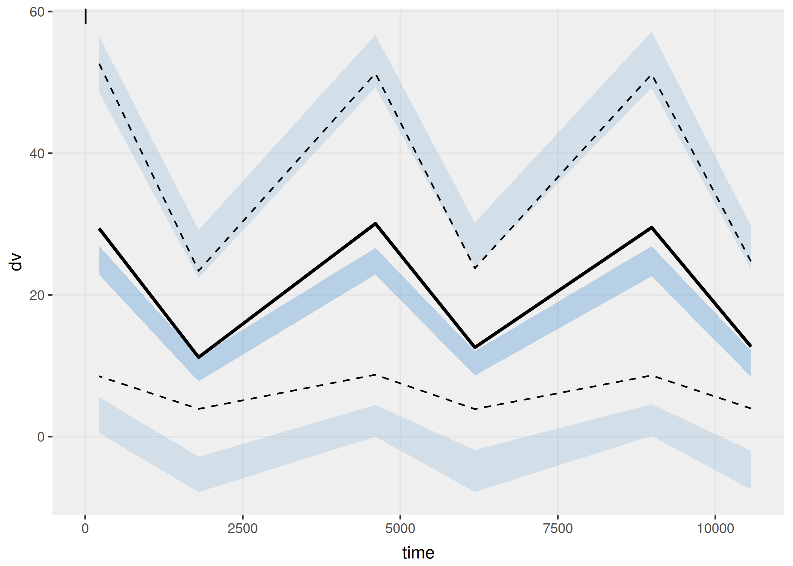
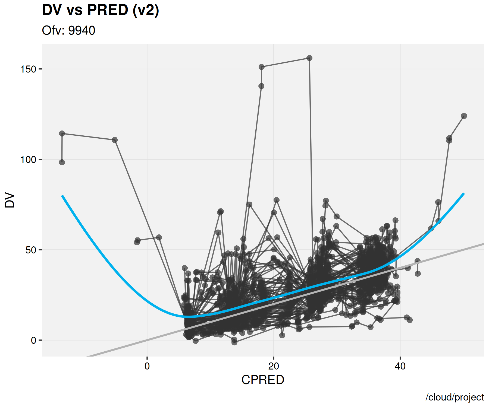
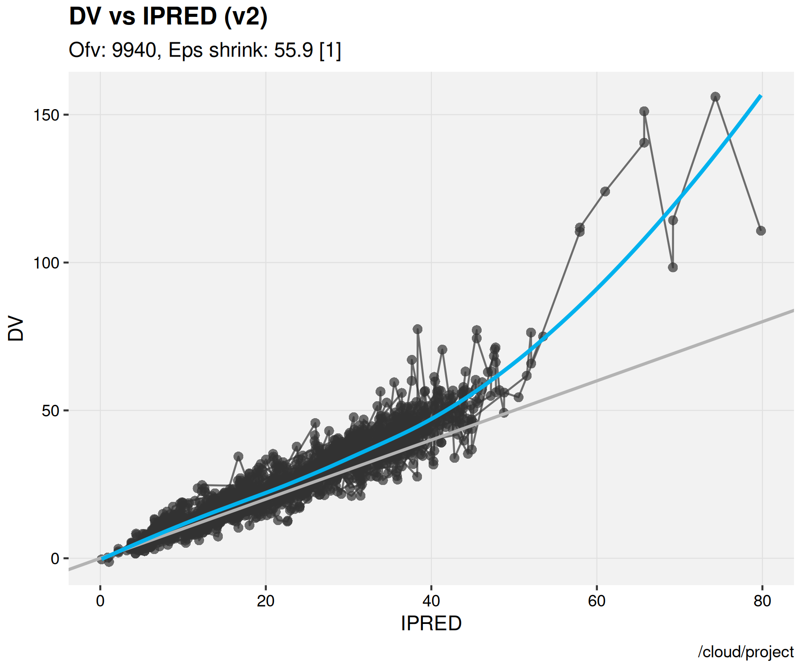
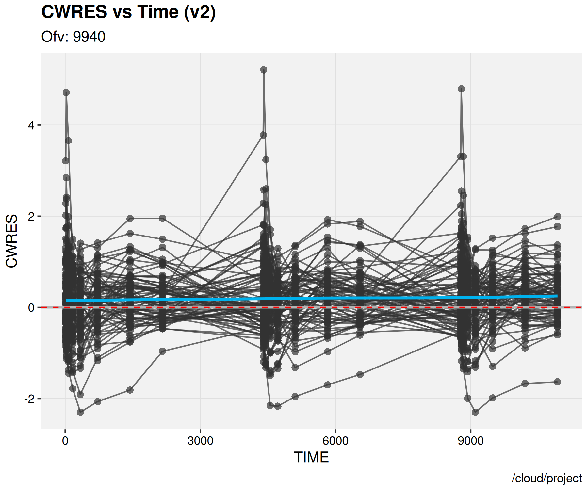

# QSS-Approximation TMDD Model — Denosumab (nlmixr2)

Simulation-based parameter recovery for a two-compartment target-mediated drug disposition (TMDD) model under the quasi-steady-state (QSS) approximation, in R / nlmixr2 with SAEM.

**The question:** given a published TMDD-QSS parameter set, can those parameters be recovered by re-fitting to data simulated from them — and which cannot?

**The answer:** the linear disposition parameters recover well. The TMDD parameters produce plausible point estimates with 86–94% shrinkage, meaning the data does not actually inform them. This independently reproduces a limitation the source paper reported from 615 real patients.

Jyotheeshwar Akshay Ravikumar · Sri Ramachandra University (SRIHER), Chennai
R 4.6.1 · nlmixr2 (SAEM) · rxode2 · xpose.nlmixr2 · ggplot2 · vpc

---

## Methodology — read this first

**This is not an analysis of real patient data.**

Patient-level denosumab concentrations are not publicly available. What *is* public is the **fitted parameter table** from Choi et al. (2025), estimated by those authors from 6,583 real serum concentrations in 615 subjects.

This project takes those estimates as ground truth, simulates a dataset from them (80 subjects × 24 samples, with the published IIV and residual error), re-fits the model, and compares. That is **simulation-based parameter recovery** — a standard estimability method, not a clinical analysis.

---

## Results

| Parameter | True | Recovered | % error | %RSE | Shrinkage |
|---|---|---|---|---|---|
| ka (1/h) | 0.0078 | 0.00876 | +12.3% | 2.6 | 18.9% |
| Vc (L) | 1.58 | 2.169 | +37.3% | 22.4 | 30.4% |
| Vp (L) | 6.06 | 6.190 | +2.2% | 3.1 | 87.2% |
| CL (L/h) | 0.006 | 0.00706 | +17.7% | 1.2 | 46.3% |
| Q (L/h) | 0.20 | *fixed* | — | — | — |
| kint (1/h) | 0.022 | 0.01680 | −23.7% | 9.8 | **94.2%** |
| Kss (nmol/L) | 1.56 | 1.263 | −19.1% | **660** | **92.1%** |
| ksyn (1/h) | 0.01 | 0.00765 | −23.5% | 6.6 | **90.8%** |
| R0 (nmol/L) | 15.23 | 15.638 | +2.7% | 11.4 | **86.6%** |

All eight estimated parameters within ±37%; six within ±25%. Seven of eight have %RSE under 25%.

`Q` was fixed to its literature value after returning 499% RSE and 902% CV in the first fit — it was not being estimated in any meaningful sense. Fixing an unidentifiable parameter to a known value is the same standard remedy used for Ka in this portfolio's Theophylline project.

### Visual predictive check



Observed percentiles track the model-predicted intervals across the dosing cycle, though the model sits low against the upper percentiles — consistent with the systematic underprediction documented under Limitations.

### Goodness of fit





IPRED tracks observations more closely than PRED, as expected. Both show points sitting predominantly above the line of identity — the model under-predicts across the concentration range.



CWRES against time shows no strong trend with time itself, indicating the structural time-course is broadly captured; the bias is in magnitude rather than shape.

---

## The main finding: estimated is not identified

Point estimates for `kint`, `Kss`, `ksyn` and `R0` land within ~25% of truth. Taken alone that looks like successful recovery. It isn't.

**Shrinkage on those four parameters is 86.6% to 94.2%.**

Shrinkage above ~30% conventionally means the data carry little individual-level information and the estimator is falling back on the population mean. At 94%, individual η estimates are essentially uninformative — the model cannot distinguish one subject's target dynamics from another's.

`Kss` makes the point sharpest: point estimate 19% from truth, but **%RSE of 660%** and between-subject variability of 182% CV. It landed near the true value without the data meaningfully constraining it.

**This reproduces the source paper's own reported limitation.** Choi et al. observed high shrinkage in the TMDD-related parameters (R0, kint, KSS), attributing it to the limited informativeness of PK-only data for receptor-mediated dynamics and noting that absent target concentration measurements are a known factor impairing TMDD identifiability. They reported it from 615 real patients; this reproduces it from 80 simulated ones.

The finding survived a complete redesign of the sampling schedule between v1 and v2 — evidence that it reflects a property of the model–data combination, not an artifact of one design choice.

---

## Known limitations

Stated plainly, because they are not resolved.

**1. Residual error is inflated and the cause is unidentified.** `add.err` estimated at 7.88 against a true 0.72 (~11×); `prop.err` 0.298 against 0.07. In v1 these were 2.68 and 0.589. The v2 sampling redesign improved every structural parameter but made the residual terms worse, indicating the error model is absorbing a misspecification the sampling change did not address.

**2. Systematic underprediction persists.** 75.4% of residuals positive, mean +3.33 nmol/L. Seven hypotheses were tested and eliminated; the cause remains unexplained. A model that underpredicts systematically is not fit for inference, and no inference beyond parameter recovery is drawn here.

**3. Kss is not identifiable in this design.** 660% RSE. The point estimate should not be treated as meaningful.

**4. Simulation-based, not clinical.** See the methodology note.

**5. Single replicate.** A proper estimability assessment would use a stochastic simulation and estimation (SSE) study across many replicate datasets. This is one dataset, one fit; the errors reported carry no confidence interval across replicates.

---

## Development history

The first fit converged but underpredicted systematically (mean residual +5.01, >75% positive, max IPRED 70.6 against observed 120.8, `add.err` 2.68 against true 0.72).

**Seven hypotheses were tested by direct measurement.** Five rejected, two partly confirmed. Full detail and the test scripts are documented in **[DEBUGGING.md](DEBUGGING.md)**.

The two corrections that mattered:

- **Sampling design.** v1 sampled at 3600 h and 4380 h post-dose, where the typical curve sits at 1.41 and 0.095 nmol/L. Against an additive error of 0.72, noise at the 4380 h trough is ~7× the signal, and SAEM weights by inverse variance. v2 removed those offsets and added coverage in the informative region; minimum typical concentration rose from 0.095 to 8.55 nmol/L.
- **Initial variances** set at the true ω² values rather than below them (v1 initialised `eta_Vc` at 0.20 against a true 0.3225 and it collapsed 20-fold).

| Metric | v1 | v2 |
|---|---|---|
| mean(DV − IPRED) | +5.014 | **+3.327** |
| max IPRED | 70.6 | 79.8 |
| ka % error | +54% | **+12.3%** |
| Vc % error | +117% | **+37.3%** |
| Vp % error | +21% | **+2.2%** |
| R0 % error | −26% | **+2.7%** |
| kint %RSE | 24.6 | **9.8** |
| Q %RSE | 499 | fixed |

Structural recovery and precision improved substantially. The systematic bias reduced by a third but did not resolve.

---

## Model

Two-compartment TMDD, QSS approximation, first-order subcutaneous absorption.

```
depot --ka--> central (Ctot) <--Q--> peripheral (Cp)
                  |
                  +-- CL (linear elimination)
                  +-- kint * RC (target-mediated elimination)

target: Rtot, synthesised at ksyn, degraded at kdeg, internalised as complex at kint
```

QSS closed form for free drug:

```
C  = ½ · [ (Ctot − Rtot − Kss) + √( (Ctot − Rtot − Kss)² + 4·Kss·Ctot ) ]
RC = Ctot − C
```

Dosing 60 mg SC at months 0, 6, 12 (408.2 nmol, MW ≈ 147 kDa). Concentrations nmol/L, volumes L, time hours. SAEM, 300 burn-in + 400 EM.

**Derived parameter:** `kdeg` is not reported separately in Table 3. It follows from the steady-state assumption in the paper's Methods (their Eq. 7), `ksyn = kdeg × R0`, giving `kdeg = 6.566e-4 /h`. Documented here because an undocumented derived parameter is a reproducibility gap.

---

## Sources

**Ground truth:** Choi S, Park S, Jung J, Baek S, Lim H-S (2025). *Population pharmacokinetics/pharmacodynamics analysis confirming biosimilarity of SB16 to reference denosumab.* Frontiers in Pharmacology 16:1631034. doi:10.3389/fphar.2025.1631034 — open access, CC-BY. Table 3 supplies every parameter used.

**Model theory:**
- Dua P, Hawkins E, van der Graaf PH (2015). *A Tutorial on Target-Mediated Drug Disposition (TMDD) Models.* CPT Pharmacometrics Syst Pharmacol 4(6):324–337.
- Gibiansky L, Gibiansky E, Kakkar T, Ma P (2008). *Approximations of the target-mediated drug disposition model and identifiability of model parameters.* J Pharmacokinet Pharmacodyn 35(5):573–591.

---

## Repository contents

```
denosumab_QSS_TMDD_v2.R          primary script (simulation, fit, diagnostics)
denosumab_QSS_TMDD_nlmixr2.R     v1 script, retained for the v1→v2 comparison
DEBUGGING.md                     full diagnostic trail, seven hypotheses

diagnostic_test_v2.R             hypothesis 4 (variance initialisation)
structural_test.R                hypothesis 5 (sim vs fit model equivalence)
data_handling_test_v2.R          hypothesis 6 (pk_data vs eventTable)
test_error_model.py              hypothesis 1 (clipping bias)
test_identifiability.py          hypothesis 2 (sampling design)
sanity_check_qss.py              pre-implementation ODE verification

simulated_denosumab_data_v2.csv  simulated dataset (1920 rows, 80 subjects)
fit_v2.rds                       fitted model object
parameter_recovery_v2.csv        true vs recovered comparison
v2_01_dv_vs_pred.png             GOF: DV vs PRED
v2_02_dv_vs_ipred.png            GOF: DV vs IPRED
v2_03_cwres_time.png             CWRES vs time
v2_04_cwres_pred.png             CWRES vs PRED
v2_05_vpc.png                    visual predictive check
session_info_v2.txt              R session details
```

---

## Reproducing

```r
install.packages(c("nlmixr2", "rxode2", "ggplot2", "dplyr",
                   "xpose.nlmixr2", "vpc"))

source("denosumab_QSS_TMDD_v2.R")
```

Approximately 45–60 minutes for the SAEM fit on Posit Cloud free tier. Session details in `session_info_v2.txt`.

Note: `eventTable()` is called without `amount.units`/`time.units`. Supplying them requires the `units` package, absent from a default Posit Cloud image, which caused a silent simulation failure during development.

---

## What this demonstrates

- A QSS-approximation TMDD model as a four-state ODE system in rxode2/nlmixr2
- Simulation-based parameter recovery against a published parameter set
- Using shrinkage and %RSE to distinguish a parameter that is *estimated* from one that is *identified*
- Systematic diagnosis: seven hypotheses, each tested by direct measurement, scripts retained
- Independently reproducing a published identifiability limitation
- Documenting unresolved problems rather than presenting a clean result

---

Part of a pharmacometrics portfolio in preparation for doctoral research in Quantitative Systems Pharmacology.

MIT licensed. Ground-truth parameters reproduced from Choi et al. (2025) under CC-BY with attribution.
